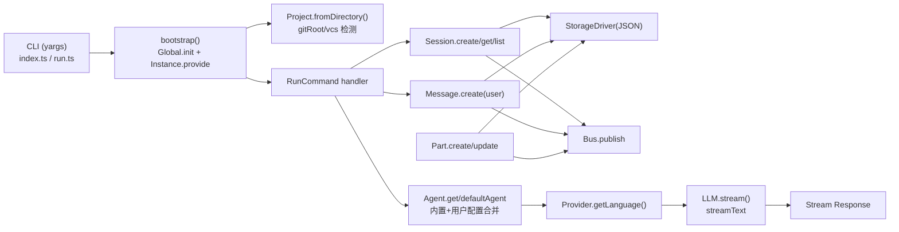
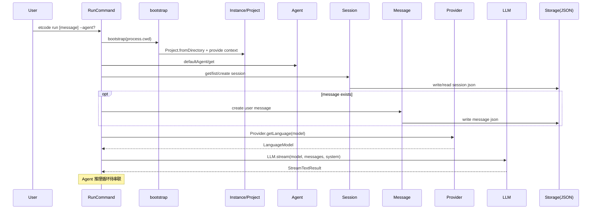
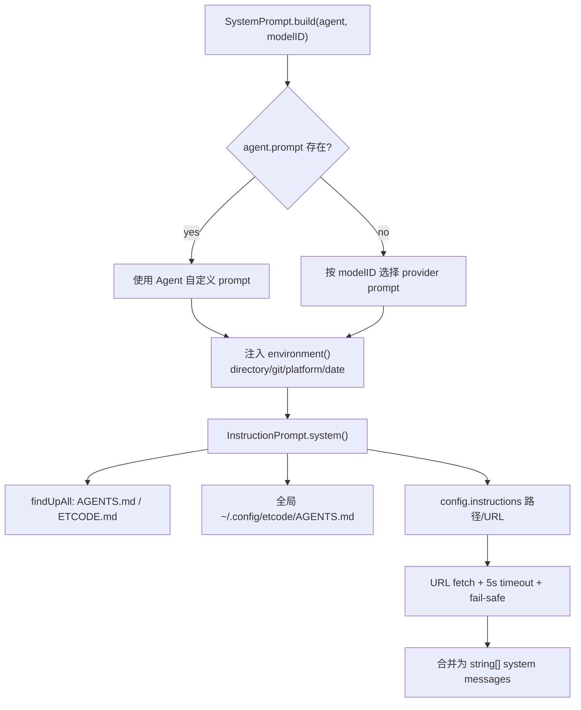
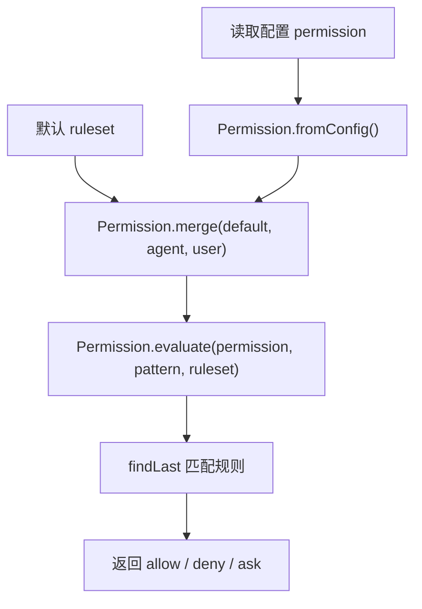
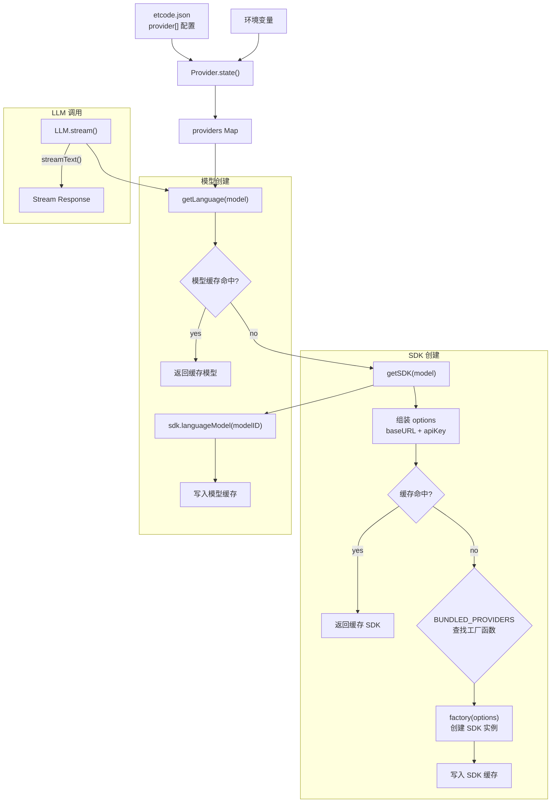

# etcode 项目面经（基于当前代码）

> 版本基线：截至 2026-02-27，基于 `packages/etcode/src` 当前实现整理。
> 目标：这份文档可直接用于面试讲解、简历项目描述、以及高频追问准备。

## 1. 项目一句话定位

`etcode` 是一个 **AI 驱动的 CLI Code Agent 框架**：当前已实现 CLI 启动、项目上下文识别、会话/消息/片段模型、JSON 持久化、权限规则与提示词拼装、多模型 Provider 适配与 LLM 流式调用层。Agent 完整的"推理执行循环"正在接入中。

## 2. 当前总体实现（已完成 / 未完成）

### 2.1 已完成

1. Monorepo 工程骨架：`pnpm workspace + turbo + TypeScript ESM`。
2. CLI 入口和命令体系：`index.ts + run` 命令。
3. 全局目录初始化：`data/log/cache/config/state` 基于 XDG 目录落地。
4. 项目上下文管理：`Project.fromDirectory + AsyncLocalStorage Instance`。
5. 三层会话数据模型：
   - `Session`（会话）
   - `Message`（用户/助手消息）
   - `Part`（文本片段/工具调用片段）
6. JSON 存储抽象：`StorageDriver` + `createJsonStorage`。
7. 事件总线：`BusEvent.define + Bus.publish/subscribe/once`。
8. Agent 注册与权限合并：
   - 内置 `build/plan/general/explore/compaction/title/summary`
   - 支持通过 `etcode.json` 覆盖 prompt/model/permission 等配置
9. System Prompt 分层拼装：
   - Provider prompt
   - Environment prompt
   - Instruction prompt（`AGENTS.md`/`ETCODE.md`/URL）
10. 模型调用适配与实例配置：
    - Provider 模块：`BUNDLED_PROVIDERS` 内置 4 个 SDK（openai-compatible/anthropic/openai/google）
    - SDK 实例缓存与 LanguageModel 缓存
    - 配置优先级：`config.baseURL > api`、`config.apiKey > env`
    - LLM 流式调用层：`LLM.stream()` 封装 Vercel AI SDK 的 `streamText`

### 2.2 当前边界（尚未完成）

1. `run` 命令已完成 Session 初始化与 user message 写入，Provider/LLM 模块已实现但 **Agent 推理循环尚未串联**。
2. `Part` 模块已实现但未在主流程中消费。
3. 自动化测试尚未成体系（仓库内未发现实际测试用例文件）。

## 3. 总体架构图



## 4. 关键流程图

### 4.1 `etcode run` 主流程



### 4.2 System Prompt 拼装流程



### 4.3 权限规则决策流程



### 4.4 Provider 与 LLM 调用流程



## 5. 核心数据模型与存储

### 5.1 三层模型

1. Session
   - 顶层会话实体，含 `projectID/directory/agent/time`。
2. Message
   - `discriminatedUnion(role)`：
     - `user`：带 `content`
     - `assistant`：预留给后续模型输出
3. Part
   - `discriminatedUnion(type)`：
     - `text`：文本片段
     - `tool`：工具调用状态（`pending/running/completed/failed`）

### 5.2 存储路径

```text
~/.local/share/etcode/storage/{projectID}/
├── session/{sessionID}.json
├── message/{sessionID}/{messageID}.json
└── part/{messageID}/{partID}.json
```

## 6. 面试时可强调的设计亮点

1. 分层清晰：CLI、上下文、会话模型、存储、事件、Agent 配置、Provider 相互解耦。
2. 类型安全：核心实体都由 Zod schema 驱动，Message/Part 使用判别联合。
3. 事件驱动：写入存储后发布事件，后续可无侵入接 UI/审计/指标模块。
4. 可替换存储：`StorageDriver` 把业务逻辑与 JSON 实现解耦，易迁移 SQLite。
5. 提示词分层：Provider/Environment/Instruction 分离，支持团队规范动态注入。
6. 权限可配置：默认规则 + agent 规则 + 用户规则合并，支持细粒度 allow/deny/ask。
7. 模型适配层：通过 `@ai-sdk/openai-compatible` 通用适配器 + `BUNDLED_PROVIDERS` 工厂映射，统一接入 OpenAI/Anthropic/Google/国产大模型，SDK 与模型双层缓存。

## 7. 可主动讲出的技术债（会加分）

1. `Project.id` 当前为运行时生成，不是稳定 ID。
   - 影响：跨进程重启后 `Session.list(project.id)` 无法命中历史会话目录。
   - 改进：改为 `hash(gitRoot || directory)` 生成稳定 `projectID`。
2. 配置合并是浅合并（`{...global, ...project}`）。
   - 影响：嵌套对象易被覆盖。
   - 改进：使用深合并策略并定义冲突优先级。
3. 事件发布未做 schema parse。
   - 影响：运行时防御不足。
   - 改进：`publish` 前校验 `def.properties.parse(...)`。
4. 缺少端到端测试。
   - 改进：先补 Session/Message/Permission 的单测，再补 run 命令集成测试。

## 8. 可直接复用的项目描述

### 8.1 简历版（偏工程实现）

- 设计并实现 AI CLI Agent 基础框架（TypeScript + pnpm/turbo），完成命令入口、上下文注入、会话模型与 JSON 持久化闭环。
- 构建 `Session -> Message -> Part` 三层数据模型与事件总线，支持消息流转、工具调用状态管理和后续模块解耦扩展。
- 实现可配置 Agent 系统与权限规则引擎（allow/deny/ask），支持多 Agent 模式与项目/全局指令动态注入。
- 基于 Vercel AI SDK 实现多模型 Provider 适配层，通过 `@ai-sdk/openai-compatible` 通用适配器统一接入 OpenAI、Anthropic、Google 及国产大模型，实现 SDK/模型双层缓存与 `streamText` 流式调用。

### 8.2 简历版（偏架构设计）

- 主导 AI Code Agent 核心架构设计，拆分为 CLI、Context、Storage、Bus、Prompt、Permission、Provider 七大模块，形成高内聚低耦合的可扩展框架。
- 通过 `StorageDriver` 抽象持久层，支持从 JSON 平滑迁移到关系型存储；通过事件驱动模式降低模块间直接依赖。
- 设计分层 Prompt 组合策略（模型层 + 环境层 + 规范层），提升多模型兼容性与团队规范落地能力。
- 设计 Provider 适配架构：`BUNDLED_PROVIDERS` 工厂映射 + 配置优先级链（config > env）+ 双层缓存，支持按需扩展新的 LLM 供应商。

### 8.3 30 秒口述版

我做的是一个 AI CLI Agent 框架，重点把"可扩展底座"搭起来了。核心包括会话三层模型、文件存储、事件总线、权限规则、系统提示词拼装，以及基于 Vercel AI SDK 的多模型 Provider 适配层。Provider 通过工厂映射和双层缓存统一接入 OpenAI、Anthropic、Google 和国产大模型，LLM 调用层封装了 `streamText` 流式接口。下一步是把这些串联成完整的 Agent 推理循环。

### 8.4 1 分钟口述版

这个项目目标是做一个可长期演进的 AI 编码助手 CLI。实现上我拆了七层：CLI 命令层、项目上下文层、Session/Message/Part 数据层、Storage 抽象层、Bus 事件层、Agent+Permission+Prompt 策略层，以及 Provider+LLM 模型调用层。

`run` 命令启动后会做全局目录初始化、项目识别、Agent 选择、会话恢复或创建，以及用户消息写入。消息和状态持久化到 JSON，变更通过事件总线广播。

Provider 模块内置了 4 个 SDK（openai-compatible、anthropic、openai、google），通过 `BUNDLED_PROVIDERS` 工厂映射和配置优先级链（config > env）组装 SDK 选项，创建后缓存。`getLanguage()` 从 SDK 获取 `LanguageModel` 实例并缓存。LLM 层的 `stream()` 封装了 `streamText`，接收 model、messages、system prompt 进行流式调用。通过 `@ai-sdk/openai-compatible` 通用适配器，DeepSeek、Moonshot 等国产模型只需配 baseURL 和 apiKey 即可接入。

设计上我看重可替换性和约束力：存储可换、Prompt 可扩、权限可配、Provider 可扩展，且模型都用 Zod 做类型约束。当前要把 Provider/LLM 串联进 Agent 推理循环，并补齐测试体系。

## 9. 高频面试问题（含答题要点）

### 9.1 架构与设计

1. 为什么采用 Session/Message/Part 三层模型？
   - 回答要点：把"会话元信息""消息角色""消息内部结构"解耦，便于支持工具调用、多模态片段和流式输出。
2. 为什么先做 JSON 存储，不直接上数据库？
   - 回答要点：MVP 阶段优先低成本验证；通过 `StorageDriver` 预留迁移路径，控制未来重构成本。
3. 事件总线的价值是什么？
   - 回答要点：把写模型与消费逻辑解耦，后续增加日志、审计、WebSocket 推送不需要改核心写入逻辑。
4. Prompt 分层相比单一系统提示词有什么优势？
   - 回答要点：模型兼容、环境感知、团队规范三类关注点分离，维护成本更低。

### 9.2 模型调用适配

1. 为什么选择 Vercel AI SDK 而不是直接调 HTTP API？
   - 回答要点：AI SDK 提供统一的 `streamText`/`generateText` 抽象，屏蔽各供应商差异（消息格式、流式协议、Tool Calling 格式）；内置重试、超时、错误分类；TS 类型安全。
2. `@ai-sdk/openai-compatible` 通用适配器的原理是什么？
   - 回答要点：多数 LLM 服务商复用 OpenAI ChatCompletion 接口格式（`/v1/chat/completions`、`role/content` 消息、工具调用格式），只需配置 `baseURL` 和 `apiKey` 即可接入。
3. 如何支持国产大模型（DeepSeek、Moonshot、通义千问）？
   - 回答要点：通过 `@ai-sdk/openai-compatible`，只需在 `etcode.json` 中配置 `api`（baseURL）和 `env`（API Key 环境变量），无需额外 SDK 或代码修改。
4. SDK 和模型为什么要做双层缓存？
   - 回答要点：SDK 创建涉及 HTTP 客户端初始化，模型创建涉及 API 元数据查询，都有初始化开销。双层缓存避免重复创建，同一 Provider 的不同模型共享 SDK 实例。
5. 配置优先级是如何设计的？
   - 回答要点：API URL 以 `config.baseURL > provider.api` 排序；API Key 以 `config.apiKey > 环境变量` 排序。遵循"显式覆盖 > 约定默认"原则。
6. 如果要新增一个 Provider SDK 怎么做？
   - 回答要点：安装 npm 包，在 `BUNDLED_PROVIDERS` 中注册工厂函数，用户在 `etcode.json` 中配置 `npm` 字段指向新包。

### 9.3 可扩展性与稳定性

1. 如何新增一个 Agent？
   - 回答要点：在配置中声明 agent 条目，继承默认权限并可覆盖 prompt/model/steps。
2. 如何避免权限配置失控？
   - 回答要点：默认最小化 + 显式覆盖 + `findLast` 规则可解释，审计时可回放决策路径。
3. 如何把存储切换到 SQLite？
   - 回答要点：实现同名 `StorageDriver`，保持 key 语义不变，逐步替换调用方无需大改。
4. 当前最大的稳定性风险是什么？
   - 回答要点：projectID 不稳定导致会话跨进程不可续接，这是优先修复项。

### 9.4 工程化与质量

1. 你如何保证类型和运行时一致？
   - 回答要点：Zod 统一 schema，类型由 `z.infer` 推导，必要场景增加 parse 做运行时防御。
2. 目前测试策略是什么？下一步怎么补？
   - 回答要点：当前以 typecheck 为主；下一步补单测（Session/Permission/Provider）+ 集成测试（run 链路 + LLM mock）。
3. 如果并发写入同一会话会怎样？
   - 回答要点：JSON 文件方案存在竞争窗口；后续引入数据库事务或文件锁机制。
4. 如何处理远程 instructions 不可用？
   - 回答要点：5 秒超时 + 降级，不影响主流程，错误只进 debug 日志。

### 9.5 性能与成本

1. 这个项目的主要耗时点在哪？
   - 回答要点：LLM API 调用是最大延迟源，其次是文件 IO 和网络指令拉取；通过流式输出降低用户感知延迟。
2. 后续做性能优化你会从哪开始？
   - 回答要点：缓存 project/config/instructions，减少重复文件扫描，SDK/模型双层缓存避免重复初始化。
3. 为什么全部使用 streamText 而不是 generateText？
   - 回答要点：CLI 场景下流式输出提升交互体验，用户可实时看到生成过程而非等待完整响应。

## 10. 你可以反问面试官的问题

1. 你们更看重 Agent 的推理质量，还是工程可控性（权限/审计/回放）？
2. 你们在生产里如何做 Prompt 版本化和回滚？
3. 你们是否有多租户/多项目隔离需求？这会影响存储和权限模型设计。
4. 在你们团队里，AI Agent 的失败重试和人工接管是怎么定义边界的？
5. 你们在接入多个 LLM 供应商时，如何做 fallback 和成本控制？

## 11. 面试前 5 分钟速记

1. 先讲目标：做可扩展的 AI CLI Agent 底座。
2. 再讲架构：CLI、Context、Data、Storage、Bus、Prompt/Permission、Provider/LLM 七层。
3. 再讲亮点：类型安全、事件驱动、可替换存储、可配置权限、多模型适配 + 双层缓存。
4. 再讲边界：Provider/LLM 已实现、Agent 推理循环待串联、测试待补。
5. 最后讲路线：串联推理循环、稳定 projectID、深合并配置、运行时 schema 校验。

## 12. 模型调用适配与实例配置详解

> 详细设计文档见 `doc/provider.md`

### 12.1 整体架构

Provider 模块解决"如何统一接入不同 LLM 供应商"的问题，基于 Vercel AI SDK 实现。

```text
etcode.json provider[] + 环境变量
  ↓
Provider.state() → providers Map
  ↓
Provider.getSDK(model) → BUNDLED_PROVIDERS 工厂 → 缓存
  ↓
Provider.getLanguage(model) → sdk.languageModel() → 缓存
  ↓
LLM.stream() → streamText({ model, messages, system })
```

### 12.2 核心机制

**BUNDLED_PROVIDERS**：将 npm 包名映射到 `create*` 工厂函数，目前内置 4 个：

| SDK 包名 | 用途 |
|----------|------|
| `@ai-sdk/openai-compatible` | 通用适配器（DeepSeek/Moonshot/GLM 等） |
| `@ai-sdk/anthropic` | Claude 系列 |
| `@ai-sdk/openai` | GPT 系列 |
| `@ai-sdk/google` | Gemini 系列 |

**双层缓存**：

- SDK 层：以 `{ providerID, npm, options }` 序列化为 key
- 模型层：以 `providerID/modelID` 为 key

**配置优先级**：

- baseURL：`config.baseURL > provider.api`
- apiKey：`config.apiKey > env 环境变量`

### 12.3 LLM 调用

当前统一使用 `streamText`（流式调用），返回 `StreamTextResult`。调用入口为 `LLM.stream()`，接受 model、messages、system prompt、temperature 等参数。

### 12.4 国产模型接入示例

```json
{
  "provider": [
    {
      "id": "deepseek",
      "npm": "@ai-sdk/openai-compatible",
      "api": "https://api.deepseek.com/v1",
      "env": ["DEEPSEEK_API_KEY"],
      "model": "deepseek-chat"
    }
  ]
}
```

只需配置 `api`（baseURL）和 `env`（API Key 环境变量），无需额外代码。
