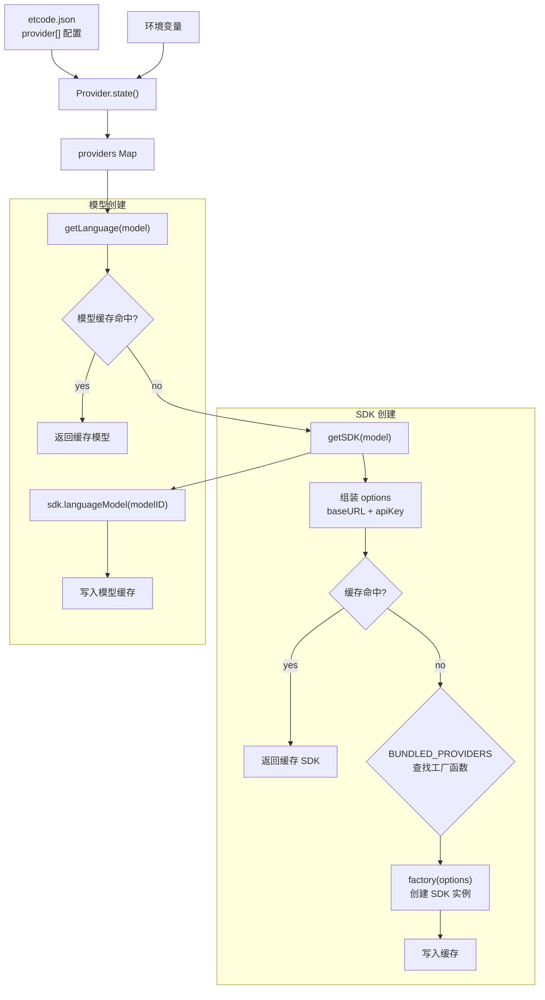

# 模型调用适配与实例配置

> 参考：[智能体核心模块 4 — 模型调用适配和实例配置](https://zhuanlan.zhihu.com/p/2007936774299727730)

## 概述

Provider 模块负责将 etcode 与各类 LLM 服务对接。核心依赖 Vercel AI SDK（`ai` + `@ai-sdk/*`），通过 `@ai-sdk/openai-compatible` 通用适配器支持任何 OpenAI 兼容 API 的大模型服务商。

## 架构

```text
Config（etcode.json / 环境变量）
  ↓
Provider.state()  ← 加载 provider 配置 + 环境变量
  ├── providers: Record<id, Info>
  ├── sdkCache: Map<hash, SDK>
  └── modelCache: Map<providerID/modelID, LanguageModel>
  ↓
Provider.getSDK(model)
  → 组装 options（baseURL, apiKey）
  → 查缓存 / 调用 BUNDLED_PROVIDERS 工厂函数
  ↓
Provider.getLanguage(model)
  → getSDK → sdk.languageModel(modelID)
  → 缓存并返回 LanguageModel
  ↓
LLM.stream(input)
  → Provider.getLanguage(model)
  → streamText({ model, messages, system, ... })
```

## @ai-sdk/openai-compatible 原理

许多 LLM 服务商的 API 接口与 OpenAI ChatCompletion 接口兼容：

- 相同的 API 端点结构（`/v1/chat/completions`）
- 相同的消息格式（`role`, `content`）
- 相同的工具调用格式

因此，`@ai-sdk/openai-compatible` 适配器只需配置 `baseURL` 和 `apiKey`，即可接入 DeepSeek、Moonshot（kimi）、通义千问、智谱 GLM 等国产大模型。

## 核心类型

### Provider.Model

```typescript
{
  id: string,           // 模型标识，如 "gpt-4o"
  providerID: string,   // 提供者 ID，如 "openai"
  api: {
    id: string,         // API 级模型 ID（可与 id 不同）
    npm: string,        // SDK 包名，如 "@ai-sdk/openai-compatible"
    url?: string,       // API 基础 URL
  },
  capabilities: {
    reasoning: boolean,
    toolcall: boolean,
    temperature: boolean,
  },
  cost: { input: number, output: number },
  limit: { context: number, output: number },
}
```

### Provider.Info

```typescript
{
  id: string,
  name: string,
  env: string[],                    // 环境变量名列表
  key?: string,                     // 解析后的 API key
  options: Record<string, unknown>, // 传给 SDK 的选项
  models: Record<string, Model>,    // 关联的模型
}
```

## 内置 SDK（BUNDLED_PROVIDERS）

| npm 包名 | 工厂函数 | 用途 |
|----------|---------|------|
| `@ai-sdk/openai-compatible` | `createOpenAICompatible` | 通用适配器，支持所有 OpenAI 兼容 API |
| `@ai-sdk/anthropic` | `createAnthropic` | Claude 系列 |
| `@ai-sdk/openai` | `createOpenAI` | GPT 系列 |
| `@ai-sdk/google` | `createGoogleGenerativeAI` | Gemini 系列 |

## 配置

### etcode.json 中的 provider 配置

```json
{
  "provider": [
    {
      "id": "deepseek",
      "npm": "@ai-sdk/openai-compatible",
      "api": "https://api.deepseek.com/v1",
      "env": ["DEEPSEEK_API_KEY"],
      "model": "deepseek-chat"
    },
    {
      "id": "openai",
      "npm": "@ai-sdk/openai",
      "env": ["OPENAI_API_KEY"],
      "model": "gpt-4o"
    },
    {
      "id": "anthropic",
      "npm": "@ai-sdk/anthropic",
      "env": ["ANTHROPIC_API_KEY"],
      "model": "claude-sonnet-4-20250514"
    }
  ]
}
```

### 配置字段说明

| 字段 | 类型 | 默认值 | 说明 |
|------|------|--------|------|
| `id` | string | 必填 | Provider 唯一标识 |
| `npm` | string | `@ai-sdk/openai-compatible` | SDK 包名 |
| `api` | string | - | API 基础 URL |
| `env` | string[] | `[]` | 环境变量名（用于获取 API Key） |
| `apiKey` | string | - | 直接配置 API Key（优先级低于 env） |
| `baseURL` | string | - | 覆盖 API 基础 URL |
| `model` | string | - | 默认模型 ID |

### 配置优先级

#### API URL

1. `config.provider[].baseURL` — 用户配置文件中的自定义 URL
2. `config.provider[].api` — Provider 定义中的 URL

#### API Key

1. `config.provider[].apiKey` — 用户配置文件中的 API Key
2. 环境变量 — `config.provider[].env` 中定义的变量
3. Provider 解析后的 key

## 配置流程图



## LLM 调用层

### 流式调用 — streamText

`LLM.stream()` 是主要调用入口，用于实时获取 LLM 生成内容：

```typescript
const result = await LLM.stream({
  model,
  messages: [...],
  system: ["system prompt..."],
  temperature: 0.7,
})

for await (const chunk of result.textStream) {
  process.stdout.write(chunk)
}
```

### 普通调用 — generateText

当前项目所有调用均使用 `streamText`。`generateText` 适用于一次性获取完整响应的场景，如标题生成、摘要生成。

### 关键区别

| 方式 | 返回 | 适用场景 |
|------|------|---------|
| `streamText` | 流式响应 | 实时展示生成内容 |
| `generateText` | 完整响应 | 标题/摘要等一次性结果 |

## 缓存策略

- **SDK 缓存**：以 `JSON.stringify({ providerID, npm, options })` 为 key，避免重复创建 SDK 实例
- **模型缓存**：以 `providerID/modelID` 为 key，避免重复创建 LanguageModel 实例
- **重置**：`Provider.reset()` 清空所有缓存，用于配置变更后重新加载

## Agent 集成

Agent 的 `model` 字段指定 `{ providerID, modelID }`，通过 `Provider.resolveModel(agent)` 构建 `Provider.Model` 实例，然后传入 `LLM.stream()` 完成调用。

```text
Agent.get("build")
  → agent.model = { providerID: "openai", modelID: "gpt-4o" }
  → Provider.resolveModel(agent) → Model
  → LLM.stream({ model, messages, system })
```

## 扩展性

### 添加新的 Provider SDK

1. 安装 npm 包：`pnpm add @ai-sdk/xxx --filter etcode`
2. 在 `provider.ts` 的 `BUNDLED_PROVIDERS` 中注册工厂函数
3. 用户在 `etcode.json` 中配置 `npm: "@ai-sdk/xxx"`

### 国产模型接入

大部分国产大模型（DeepSeek、Moonshot、通义千问、智谱 GLM）均兼容 OpenAI API，只需在 `etcode.json` 中配置 `api`（baseURL）和 `env`（API Key 环境变量）即可，无需额外 SDK。
